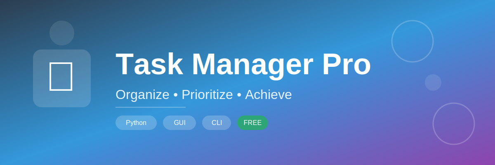
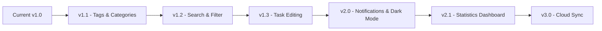

<div align="center">

# 📋 Task Manager Pro

### *Your Ultimate Productivity Companion*



<p align="center">
  
  
  
</p>

<p align="center">
  <strong>A beautiful, professional task management application with dual interfaces</strong><br>
  Boost your productivity with an intuitive GUI or lightning-fast CLI
</p>

<p align="center">
  <a href="#-features">Features</a> •
  <a href="#-getting-started">Getting Started</a> •
  <a href="#-screenshots">Screenshots</a> •
  <a href="#-usage">Usage</a> •
  <a href="#-contributing">Contributing</a>
</p>

</div>

---

## ✨ Features

<table>
<tr>
<td width="50%">

### 🎨 Beautiful Interface
- Modern, professional GUI design
- Clean two-panel layout
- Color-coded priority system
- Intuitive controls and navigation

</td>
<td width="50%">

### ⚡ Powerful Functionality
- Add, view, complete & delete tasks
- Set deadlines and priorities
- Export to JSON/CSV formats
- Auto-save with persistent storage

</td>
</tr>
<tr>
<td width="50%">

### 🖥️ Dual Mode
- **GUI Mode**: Visual, mouse-driven interface
- **CLI Mode**: Fast, keyboard-driven workflow
- Choose what fits your style!

</td>
<td width="50%">

### 🎯 Smart Organization
- High/Medium/Low priority levels
- Visual priority indicators
- Status tracking (Pending/Done)
- Confirmation dialogs for safety

</td>
</tr>
</table>

## 🖼️ Screenshots

<div align="center">

### 🎨 GUI Version


*Modern, intuitive interface with color-coded priorities and easy-to-use controls*

<br>

### 💻 CLI Version


*Fast, efficient command-line interface for power users*

</div>

<br>

## 🚀 Getting Started

### 📋 Prerequisites

```bash
✅ Python 3.7 or higher
✅ tkinter (included with Python)
✅ No external dependencies!
```

### ⚙️ Installation

<details open>
<summary><b>Quick Install</b></summary>

```bash
# Clone the repository
git clone https://github.com/[your-username]/task-manager-pro.git

# Navigate to directory
cd task-manager-pro

# Run GUI version
python task_manager_gui.py

# Or run CLI version
python task_manager.py
```

</details>

<details>
<summary><b>Alternative: Download ZIP</b></summary>

1. Click the green "Code" button above
2. Select "Download ZIP"
3. Extract the files
4. Run `python task_manager_gui.py`

</details>

## 📖 Usage

<table>
<tr>
<td width="50%">

### 🎨 GUI Version (Recommended)

```bash
python task_manager_gui.py
```


**How to use:**
1. 📝 Fill in task details on the left panel
2. ➕ Click "Add Task" button
3. 👁️ View tasks in the color-coded table
4. ✅ Select and click "Complete" or "Delete"
5. 💾 Export anytime with one click

</td>
<td width="50%">

### 💻 CLI Version

```bash
python task_manager.py
```

**Menu Options:**
```
1. ➕ Add Task
2. 👁️ View Tasks
3. ✅ Complete Task
4. 🗑️ Delete Task
5. 📄 Export to JSON
6. 📊 Export to CSV
7. 👋 Exit
```

**Quick workflow:**
- Type number → Enter
- Follow prompts
- Lightning fast! ⚡

</td>
</tr>
</table>

## 📁 File Structure

```
task-manager-pro/
│
├── task_manager.py          # CLI version
├── task_manager_gui.py      # GUI version
├── tasks.json               # Task storage (auto-generated)
├── tasks.csv                # CSV export (generated on export)
└── README.md                # This file
```

## 🎨 Priority Levels

<div align="center">

| Priority | Color | Icon | Use Case |
|----------|-------|------|----------|
| **High** | 🔴 Red | ⚠️ | Urgent tasks requiring immediate attention |
| **Medium** | 🟡 Yellow | ⚡ | Important tasks with moderate urgency |
| **Low** | 🟢 Green | ✨ | Tasks that can be completed when time permits |

*In GUI mode, tasks are automatically color-coded for instant visual recognition*

</div>

## 💾 Data Storage

Tasks are automatically saved to `tasks.json` in the following format:

```json
[
    {
        "title": "Complete project documentation",
        "deadline": "2026-04-01",
        "priority": "High",
        "completed": false
    }
]
```

## 📤 Export Options

Export your tasks in two formats:

- **JSON**: Structured data format, perfect for backups or data processing
- **CSV**: Spreadsheet-compatible format for Excel, Google Sheets, etc.

## 🛠️ Technical Stack

<div align="center">

<table>
<tr>
<td align="center" width="25%">

<br><strong>Python 3</strong>
<br><sub>Core Language</sub>
</td>
<td align="center" width="25%">

<br><strong>Tkinter</strong>
<br><sub>GUI Framework</sub>
</td>
<td align="center" width="25%">

<br><strong>JSON</strong>
<br><sub>Data Storage</sub>
</td>
<td align="center" width="25%">

<br><strong>CSV</strong>
<br><sub>Export Format</sub>
</td>
</tr>
</table>

### Design Principles

```
✨ Clean, modular code structure
🎯 Intuitive user experience  
📦 Zero external dependencies
🌐 Cross-platform compatibility
🎨 Professional visual design
```

</div>

## 🤝 Contributing

<div align="center">

**We love contributions! Here's how you can help:**

</div>

```bash
# 1. Fork the repository
# 2. Create your feature branch
git checkout -b feature/AmazingFeature

# 3. Commit your changes
git commit -m '✨ Add some AmazingFeature'

# 4. Push to the branch
git push origin feature/AmazingFeature

# 5. Open a Pull Request
```

<div align="center">

### 💡 Ideas for Contributions

| Feature | Description | Difficulty |
|---------|-------------|------------|
| 🏷️ Tags/Categories | Add task categorization | ⭐⭐ Medium |
| 🔍 Search & Filter | Find tasks quickly | ⭐⭐ Medium |
| ✏️ Edit Tasks | Modify existing tasks | ⭐ Easy |
| 🔔 Notifications | Due date reminders | ⭐⭐⭐ Hard |
| 🌙 Dark Mode | Theme toggle | ⭐⭐ Medium |
| 📊 Statistics | Task analytics dashboard | ⭐⭐⭐ Hard |

</div>

## 📝 Future Roadmap

<div align="center">



</div>

- [x] ✅ Basic task management
- [x] ✅ GUI and CLI interfaces
- [x] ✅ Priority levels
- [x] ✅ Export functionality
- [ ] 🏷️ Task categories/tags
- [ ] 🔍 Search and filter
- [ ] ✏️ Task editing
- [ ] 🔔 Due date notifications
- [ ] 🌙 Dark mode theme
- [ ] 📊 Statistics dashboard
- [ ] 📥 Import from CSV/JSON
- [ ] 🔄 Recurring tasks
- [ ] ☁️ Cloud synchronization
- [ ] 📱 Mobile companion app

## 📄 License

<div align="center">

This project is licensed under the **MIT License**

[](https://opensource.org/licenses/MIT)

*Feel free to use, modify, and distribute this project*

</div>

---

## 👤 Author

<div align="center">

**Derese Ewunet**

[](https://github.com/your-username)
[](https://linkedin.com/in/your-profile)
[](https://twitter.com/your-handle)

</div>

---

## 🙏 Acknowledgments

<div align="center">

💙 Built with Python's powerful standard library

🎨 Inspired by modern task management applications

🚀 Designed for simplicity and productivity

⭐ **If you find this project useful, please consider giving it a star!**

</div>

---

<div align="center">

### 📬 Questions or Suggestions?

Feel free to [open an issue](https://github.com/your-username/task-manager-pro/issues) or reach out!

**Made with ❤️ and ☕**

</div>
